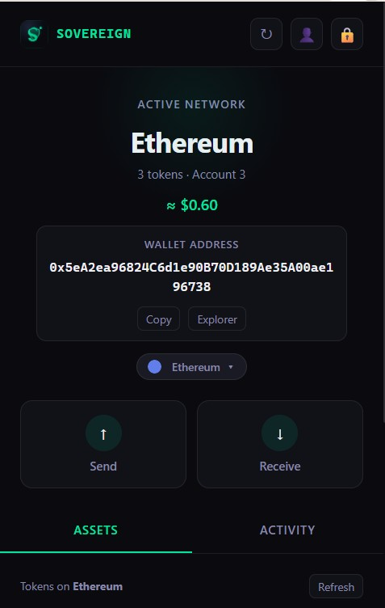
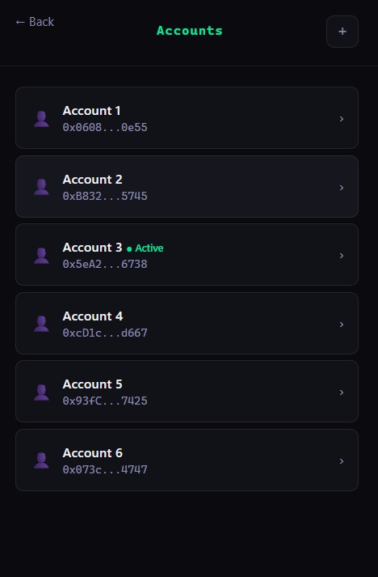
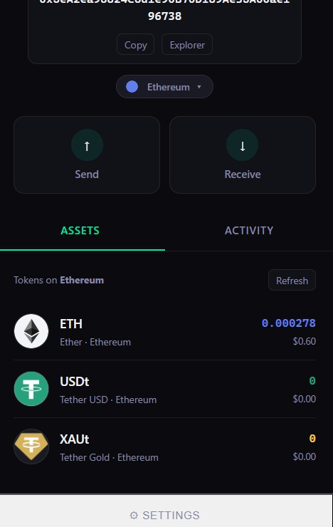
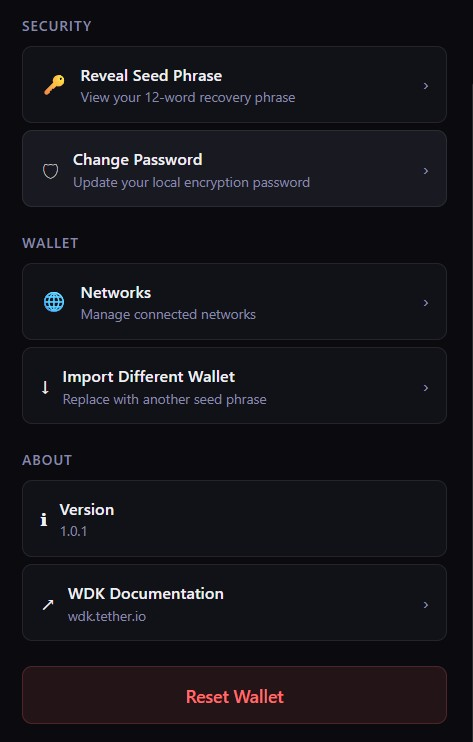

# Browser Extension Starter — Sovereign Wallet

Runnable **Chrome / Brave Manifest V3** wallet starter built with [WDK](https://wdk.tether.io).

Multi-chain self-custodial extension: **EVM** (Ethereum, Polygon, Arbitrum, BNB Smart Chain), **Bitcoin** (Blockbook), and **Solana**. Includes encrypted vault, session lock, popup UX, and a content-script `window.wdk` provider (EIP-1193-style).

Canonical upstream repo: [github.com/001453/Sovereign-wallet](https://github.com/001453/Sovereign-wallet)

## Screenshots

| Create / unlock | Portfolio | Send | Receive |
|-----------------|-----------|------|---------|
|  |  |  |  |

Demo video: [docs/demo/README.md](./docs/demo/README.md)

## Quick start

Requires Node 18+.

```bash
cd browser-extension-sovereign-wallet
npm install
npm run build:prod
```

Load the `dist/` folder from `chrome://extensions` (Developer mode → Load unpacked).

For a watched build during development:

```bash
npm run dev
```

## What it demonstrates

| Topic | Implementation |
|-------|----------------|
| Packaging | MV3 service worker, popup, content script |
| WDK | `@tetherto/wdk` with EVM, Bitcoin (Blockbook), Solana managers |
| Security | PBKDF2 + AES-256-GCM vault, session lock, MV3 CSP |
| UX | Create / import / unlock, portfolio, send / receive, HD accounts |
| dApps | `window.wdk` provider; RPCs gated by connected site origin |

## Supported networks

- **EVM:** Ethereum, Polygon, Arbitrum, BNB Smart Chain (native + USDt; XAUt on Ethereum)
- **Bitcoin:** BIP-84 via Blockbook HTTP
- **Solana:** mainnet RPC

## Repository layout

| Path | Role |
|------|------|
| `src/background/` | Vault, session, WDK (`wdk-manager.js`) |
| `src/config/chains.js` | RPC URLs and token contracts |
| `public/popup.html`, `public/popup.js` | Popup UI |
| `src/content/index.js` | In-page `window.wdk` bridge |
| `docs/ARCHITECTURE.md` | Architecture and message flow |
| `webpack.config.js` | Production bundle for MV3 |

## WDK packages

- `@tetherto/wdk`
- `@tetherto/wdk-wallet-evm`
- `@tetherto/wdk-wallet-btc`
- `@tetherto/wdk-wallet-solana`

## Grant deliverables

This example targets the [Browser Extension Starter](https://tether.dev/grants/bounties/) grant ($4,000 USD₮). See [docs/GRANT_APPLICATION.md](./docs/GRANT_APPLICATION.md) for the deliverable checklist and application text.

## License

Apache-2.0 — see [LICENSE](./LICENSE).
